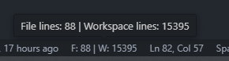

# CodeQuantum

The CodeQuantum extension lets you have an insight of the number of lines of code in your opened file and the total lines of code in the workspace. The Number of lines of code is displayed in the status bar.

## Features

- Display the number of lines of code in the status bar
- You can change the alignment of the status bar item in the extension settings
- The counter excludes files that are listed in .gitignore, .vscodeignore and .ignore files

  

## Repository

The source code for this extension is available on [GitHub](https://github.com/DarioCasciato/vscode-codequantum.git). Contributions, bug reports, and feature requests are welcome.

## License

This extension is released under the [MIT License](LICENSE).

## Credits

This extension was developed by [Dario Casciato](https://github.com/DarioCasciato/).